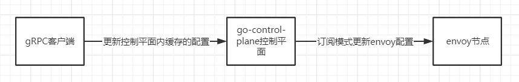

# go-control-plane的案例
***
基于go-control-plane项目创建的一个案例，使用原有框架实现了通过一个gRPC对控制平面进行热更新

基本原理如上，通过一个gRPC客户端去更新控制平面里面的缓存，缓存更新的时候会通过订阅/发布去通知订阅了该控制中心的envoy更新配置

基本只能更新一部分xDS的对应字段，比如更新LDS的监听端口，更新RDS的路由的CDS名称，更新CDS内嵌套的EDS等

主要是用来作为理解动态配置控制平面的案例使用